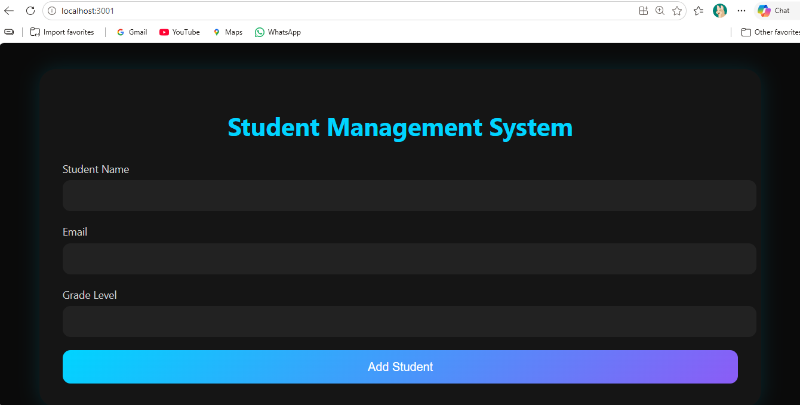
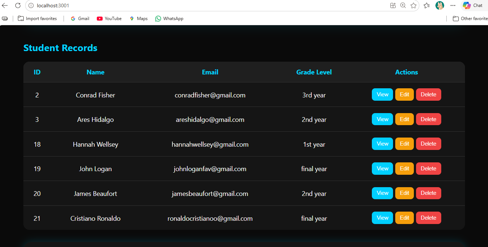
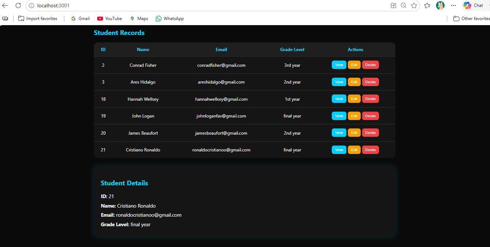
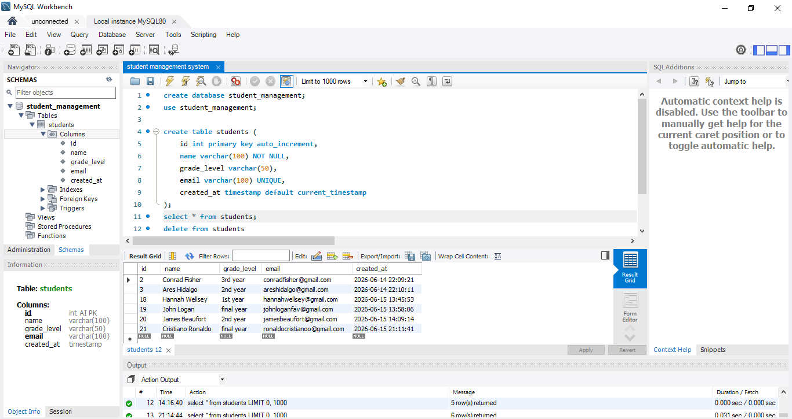

# Student Management System

## Project Overview

The Student Management System is a Full Stack Web Application developed using React.js, Spring Boot, JDBC, and MySQL. The application allows users to manage student records efficiently through a simple and user-friendly interface.

Users can perform complete CRUD operations including adding, viewing, updating, and deleting student records. The frontend communicates with the backend using REST APIs, while MySQL is used for persistent data storage.

## Features

* Add Student Records
* View All Students
* Update Student Information
* Delete Student Records
* REST API Integration
* MySQL Database Connectivity
* Responsive User Interface
* Full CRUD Operations

## Technologies Used

### Frontend

* React.js
* JavaScript (ES6)
* CSS3
* Axios

### Backend

* Spring Boot
* Java
* JDBC

### Database

* MySQL

### Development Tools

* Visual Studio Code
* Spring Tool Suite (STS)
* MySQL Workbench
* Git
* GitHub

## Project Structure

```text
demo
│
├── src
│   ├── main
│   │   ├── java
│   │   │   └── com.student.demo
│   │   │       ├── config
│   │   │       │   └── CorsConfig.java
│   │   │       ├── controller
│   │   │       │   └── StudentController.java
│   │   │       ├── model
│   │   │       │   └── Student.java
│   │   │       ├── repository
│   │   │       │   └── StudentRepository.java
│   │   │       ├── service
│   │   │       │   └── StudentService.java
│   │   │       └── DemoApplication.java
│   │   │
│   │   └── resources
│   │       └── application.properties
│   │
│   └── test
│       └── DemoApplicationTests.java
│
├── pom.xml
│
└── student-frontend
    ├── public
    ├── src
    │   ├── App.js
    │   ├── App.css
    │   ├── index.js
    │   └── index.css
    ├── package.json
    └── README.md
```

## Backend Components

* Controller Layer – Handles HTTP requests and responses.
* Service Layer – Contains business logic.
* Repository Layer – Handles database operations using JDBC.
* Model Layer – Represents the Student entity.
* Config Layer – Handles CORS configuration.

## Frontend Components

* App.js – Main React component containing UI and API calls.
* App.css – Styling for the application.
* Axios – Used for communication with Spring Boot REST APIs.

## Database Schema

```sql
CREATE TABLE students (
    id INT PRIMARY KEY AUTO_INCREMENT,
    name VARCHAR(100) NOT NULL,
    grade_level VARCHAR(50),
    email VARCHAR(100) UNIQUE
);
```

## REST API Endpoints

### Get All Students

```http
GET /api/students
```

### Get Student By ID

```http
GET /api/students/{id}
```

### Add Student

```http
POST /api/students
```

### Update Student

```http
PUT /api/students/{id}
```

### Delete Student

```http
DELETE /api/students/{id}
```

## Run the Application

### Step 1: Clone the Repository

```bash
git clone https://github.com/dvya207/student-management-systemm.git
```

### Step 2: Configure MySQL Database

Create a database:

```sql
CREATE DATABASE student_management;
```

Update application.properties:

```properties
spring.datasource.url=jdbc:mysql://localhost:3306/student_management
spring.datasource.username=root
spring.datasource.password=your_password
spring.datasource.driver-class-name=com.mysql.cj.jdbc.Driver

server.port=8080
```

### Step 3: Run Spring Boot Backend

```bash
mvn spring-boot:run
```

Backend runs on:

```text
http://localhost:8080
```

### Step 4: Run React Frontend

```bash
npm install
npm start
```

Frontend runs on:

```text
http://localhost:3001
```

## Application Screenshots

### Form & Records Page


### Student Records Details


### Student Detail View


### MySQL Database Records


## Concepts Implemented

* Layered Architecture
* RESTful Web Services
* CRUD Operations
* Dependency Injection
* Constructor Injection
* CORS Configuration
* React Hooks (useState, useEffect)
* Axios API Calls
* JDBC Database Connectivity
* MySQL Integration

## Learning Outcomes

Through this project, I gained hands-on experience in:

* Building Full Stack Applications
* Developing REST APIs using Spring Boot
* Connecting React Frontend with Spring Boot Backend
* Working with MySQL Databases
* Implementing CRUD Functionality
* Managing Application Layers (Controller, Service, Repository)
* Using Git and GitHub for Version Control
* Understanding communication between React Frontend and Spring Boot Backend using REST APIs

## Author

**Divya Jain**
Aspiring Java Full Stack Developer passionate about building scalable and user-friendly web applications.
